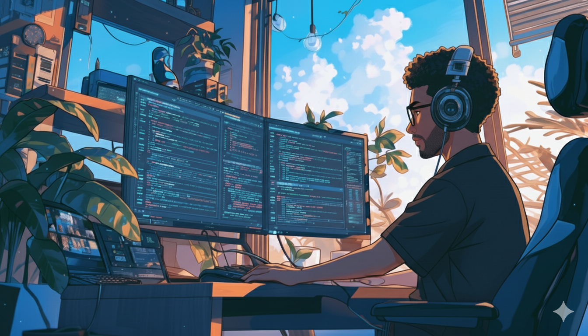

###

<h1 align="left">Full-Stack Developer en evolución | Frontend · Backend · Testing</h1>

###

<h3 align="center">Desarrollador full-stack en evolución — construyo soluciones web prácticas y mantenibles. Proactivo, polivalente y orientado al detalle; enfocado en calidad, testing y mejora continua.</h3>

###

<h3 align="left">Tecnologias:</h3>

###

   
  
  
  
  
  
  
  
  
  
  
  
  
  
  
  
  
  
  

###

<picture>
  <source media="(prefers-color-scheme: dark)" srcset="https://raw.githubusercontent.com/yeremijesus9/yeremijesus9/output/pacman-contribution-graph-dark.svg">
  <source media="(prefers-color-scheme: light)" srcset="https://raw.githubusercontent.com/yeremijesus9/yeremijesus9/output/pacman-contribution-graph.svg">
  
</picture>

###

  
  
  

###

  

###
